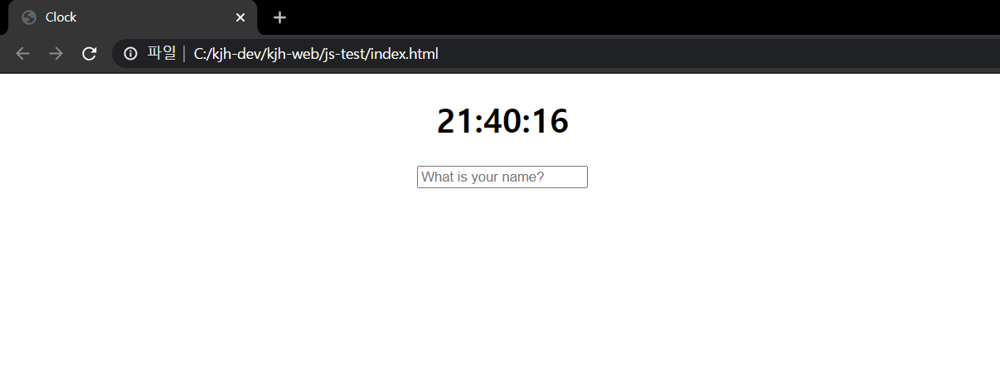
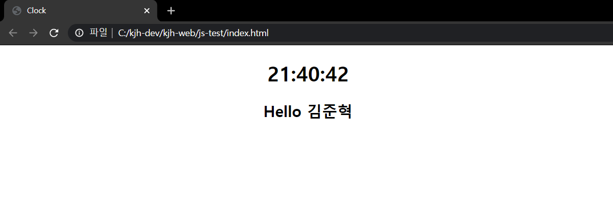

# JS-test
>학부생 3학년 2학기 때 멋쟁이사자 동아리에서 진행한 자바스크립트 사용해보기

## Installation

Windows10:

크롬 브라우저로 실행함

## Usage example

자바스크립트를 사용하여 현재 시간 및 쿠키에 데이터 저장 및 활용 실습

## Development setup

HTML, CSS, Javascript

## Release History

* 1.0.0
    * first commit
    * 실습 완료

## Meta

김준혁 – wnsgur1198@naver.com

[https://github.com/wnsgur1198/Korean_history-TOEIC-reminder]

## Contributing

1. Fork it (<https://github.com/yourname/yourproject/fork>)
2. Create your feature branch (`git checkout -b feature/fooBar`)
3. Commit your changes (`git commit -am 'Add some fooBar'`)
4. Push to the branch (`git push origin feature/fooBar`)
5. Create a new Pull Request

<!-- Markdown link & img dfn's -->
